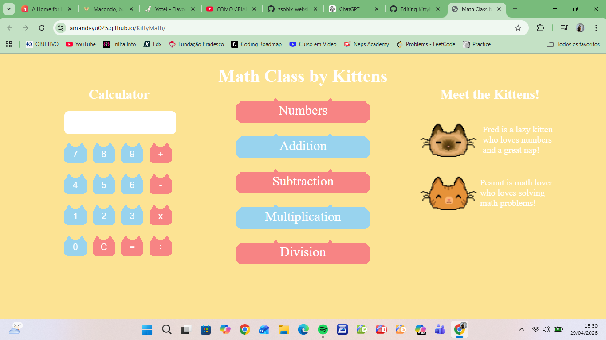

# Kitty Math
It's a website with basic math lessons, teached by kittens.
The site was built using HTML,CSS and JS; the images were made in pixilart.
This is my first website, so I tried to combine two things that i like most, math and cats ^o^

