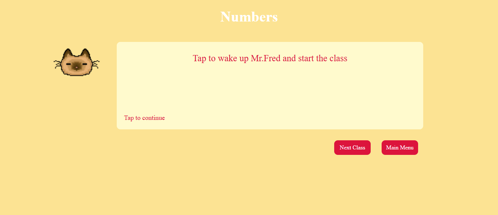

# Kitty Math
## Description
It's a website with basic math lessons, teached by kittens.
The site was built using HTML,CSS and JS; the images were made in pixilart.
This is my first website, so I tried to combine two things that i like most, math and cats ^o^

The main page contains the list to all classes, images of the kittens and a calculator.
Every class page has the monologue of the kitten, "main menu" button and a "next class" button.

## Use instructions
### Main Page

1. Calculator for addition, subtraction, multiplication and divison.
2. Access all classes.

### Class Page 

1. Click on any part of the monologue balloon to continue.
2. Access the next class by the first button.
3. Access the main menu b the second button.
